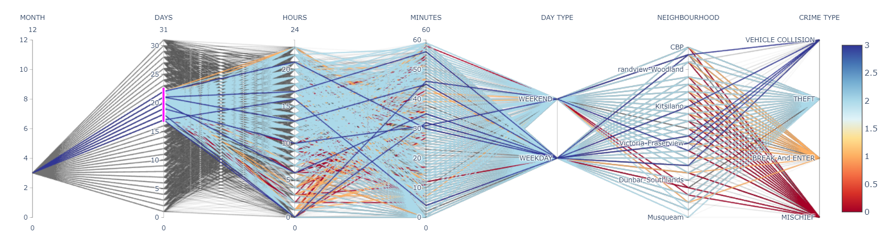

## Vancouver Crime Vizualization

### Abstract

We studied the intricacies of Crime Dataset obtained for Vancouver in detail as part of the
project to get insights, trends and patterns of crime happening in the city. It’s aimed to
visualise and get a better picture of crime data with the help of powerful visualizations
which fosters advanced analytical decisions. With multiple ways of visualizing crime
information, we present charts that improve cognitive mental model of its users to derive
crisp and clear understanding of the data. The interactivity of the charts enable the users to
analyze sub-section of the data in no time. The idea is based on the vision to provide
efficient quick insights and analytics not only to the legal authorities but to the layman
person as well. We also applied machine learning model to the data which can be used to
predict crime occurrence with a fair amount of accuracy. This intellect one gets is critical, as it relates to the lives of each and every person in the city. Lastly we tried to justify model predictions through model interpretability, which helped us to explain model decisions with the help of features in favour and those opposing it.

### Instructions to Run the project

1) Before running the app please check if all the required libraries are installed.
2) If any libraries are not installed, they can easily be installed by "pip install <library_name>"
3) The project can be run either by setting the "FLASK_APP=app" and the flask run from command line or directly executing "python app.py"

NOTE: - "http://127.0.0.1:5000/getModel" The model takes few moments to load for the first run to display sankey diagram and parallel coordinates.

### Vizualizations

**1. Crime Trends Data Visualization**

Crime Trends Visualization is mainly aimed to give its users, quick trends of crime in the
city. The filter of crime type and year enable the user to see various types of crime taking
place over a particular year and its distribution in months. Users can understand the crime
count year after year and also analyze seasonal variation in data. Crime Type filter is to
allow the user to view the prevalence of all the crime types happening over the year. Law
Enforcement agencies can formulate new laws/rules to curb a particular type of crime
majorly occurring, as suggested by this visualization. For instance, formulating traffic laws
in case of the prevalence of “Accident” type crime in the city.

**2. Neighbourhood Data Visualization**

After being able to view the crime count of a particular type of particular duration one may
want to understand how exactly is crime distributed in major areas of the city. This
visualization helps us achieve this objective. It just helps us visualize which neighborhood
contributes to the most number of crimes occurring in the city. Clicking on any
“Neighbourhood” column displays further details in the other two visualizations, namely
streetwise crime distribution and time-wise crime distribution.
Understanding Streetwise crime distribution further helps authorities pinpoint to the
streets of major interest, by indicating potential crime hit streets. This type of visualization can thus indicate any unlawful activity (like drug smuggling) going on, in the particular street under study.

Knowing the crime location alone can too be very abstract or unfruitful in terms of
controlling the crime. This is where timewise distribution of crime in a particular
neighborhood, comes in handy. Authorities can understand which time of the day has the
maximum probability of crime occurrence. A major contribution to the crime of a particular
part of the day like midnight, for instance, can indicate the authorities when to increase
patrolling and security of the area and thus optimizing the availability of their workforce.

**3. Crime Zones Data Visualization**

The main objective of the crime zones data visualization is to chart the exact geospatial
locations of crime onto a map to derive insights from it. With the help of this kind of
geospatial visualization of crime locations not only the clustered crime zones with their
counts are displayed, but also the correlations of crime occurrence in two zones. An
investigative team of Crime Experts can relate to the crime occurred in a particular area,
which later escalated to a major event. For instance, the recent accumulation of protestors
in Hong Kong to protest against the Chinese government. [3]

**4. Crime Severity Visualization**

The main objective of Heat Map visualization is to enable users to visually identify crime hotspots and zones in the city. It provides a very abstract picture of crime in the city. The user can just pan in to get further information about a particular area of the city. As naturally suggested by the redness of the particular area, authorities can straight away focus onto a particular zone/area of the city prior to even looking at other plotted visualizations our product puts forward. We also implemented the filter based on year and crime typesuggested to us in demo thus allowing the user to selectively see crime intensive areas based on selection.

**5. Parallel Coordinate System**

Having essentially a multi-dimensional time-varying data in our case, we looked into ways
of neutralizing the complexity by having a better visual approach to understand correlation
among various attributes in data. With the use of a Parallel Coordinate System, users can
better visualize how attributes of data are varying to finally being related to crime in the
city. The user has the flexibility to switch between the sequence of parallel axis and select
range in every dimension to perform a detailed analysis of its impact on the CRIME TYPE
attribute.

**6. Sankey Diagram**

With a lot of data being charted at one place, we visualized the neighborhood crime
occurrences according to DAY_TYPE plotted against the crime type. Sankey Diagrams like
these particularly showcase dominant contributors stand out by differentiating them in
various colors [4]. Users have the benefit of viewing through multiple levels. Users can get a high-level view, see specific details or generate interactive views by hovering through or
dragging DAY_TYPE, CRIME TYPE and NEIGHBOURHOOD attributes. These diagrams allow
showcasing complex processes visually while allowing users to focus on a single aspect or
resource that he/she may want to highlight.

**7. Model Interpretability with LIME**

LIME (Local Interpretable Model-agnostic Explanations) stands for explaining partial parts
of an unknown model, and it is a tool that can help us to understand and explain how a
complex machine learning model makes a decision [13]. More specifically, the explanation
given by LIME is from a local sample, the current input data, or by establishing a local
model to predict the most important features. This provides us a basic understanding of
which features contribute more to a sample and which features contradicted it. In our case,
mischief has the highest probability happening next year, and the hour contributes the
highest weight in contrast to other features.

### Challenges and Bottlenecks

● Working with Dash to render web app.

● Charting every graph into single webapp.

● Integrating global intractability across all the charts.

● Overcoming Limitations of Dash for loading large amounts of data.

● Deployment across cloud options.

● Porting everything in Flask and Bringing everything together.

● Depicting Modelling Visualization into appropriate format.

● Optimizing on Modelling time efficiency.

● Transforming Vbox widget to integrate in Flask Frontend.

### References

[1] "Flask", PyPI , 2019. [Online]. Available: https://pypi.org/project/Flask/. [Accessed: 23-
Nov- 2019].

[2] "Plotly Python Graphing Library", Plot.ly , 2019. [Online]. Available: https://plot.ly/python/.
[Accessed: 29- Nov- 2019].

[3] "China rebukes US for backing Hong Kong protesters", BBC News , 2019. [Online].
Available: https://www.bbc.com/news/world-asia-china-50584928. [Accessed: 29- Nov-
2019].

[4] "The What, Why, and How of Sankey Diagrams", Medium , 2019. [Online]. Available:
https://towardsdatascience.com/the-what-why-and-how-of-sankey-diagrams-430cbd4980b [Accessed: 29- Nov- 2019].

[5] Jayaweera, I., Sajeewa, C., Liyanage, S., Wijewardane, T., Perera, I. and Wijayasiri, A.
(2015). Crime analytics: Analysis of crimes through newspaper articles. 2015 Moratuwa
Engineering Research Conference (MERCon).

[6] Shamsuddin, N., Ali, N. and Alwee, R. (2017). An overview on crime prediction methods.
2017 6th ICT International Student Project Conference (ICT-ISPC).

[7]"Parallel Coordinates Plot", Plot.ly , 2019. [Online]. Available:
https://plot.ly/python/parallel-coordinates-plot/. [Accessed: 01- Dec- 2019].

[8]"Parallel Categories Diagram", Plot.ly , 2019. [Online]. Available:
https://plot.ly/python/parallel-categories-diagram/. [Accessed: 01- Dec- 2019].

[9]"3.2.4.3.1. sklearn.ensemble.RandomForestClassifier — scikit-learn 0.21.3
documentation", Scikit-learn.org , 2019. [Online]. Available:
https://scikit-learn.org/stable/modules/generated/sklearn.ensemble.RandomForestClassifie
r.html. [Accessed: 01- Dec- 2019].

[10]"Why Random Forest is My Favorite Machine Learning Model", Medium , 2019. [Online].
Available:
https://towardsdatascience.com/why-random-forest-is-my-favorite-machine-learning-mode
l-b97651fa3706. [Accessed: 01- Dec- 2019].

[11]"Model Interpretation Strategies", Medium , 2019. [Online]. Available:
https://towardsdatascience.com/explainable-artificial-intelligence-part-2-model-interpretati
on-strategies-75d4afa6b739. [Accessed: 01- Dec- 2019].

[12]"Understanding model predictions with LIME", Medium , 2019. [Online]. Available:
https://towardsdatascience.com/understanding-model-predictions-with-lime-a582fdff3a3b.
[Accessed: 01- Dec- 2019].

[13]Elsinghorst, S. and Elsinghorst, S. (2019). Looking beyond accuracy to improve trust in
machine learning - codecentric AG Blog. [online] codecentric AG Blog. Available at:
https://blog.codecentric.de/en/2018/01/look-beyond-accuracy-improve-trust-machine-learn
ing/?utm_content=65461834&utm_medium=social&utm_source=twitter [Accessed 1 Dec.
2019].

[14] S idr. (2019). Retrieved 2 December 2019, from https://www.berriart.com/sidr/ .(This
reference was used to develop web page slider functionality and css code).
